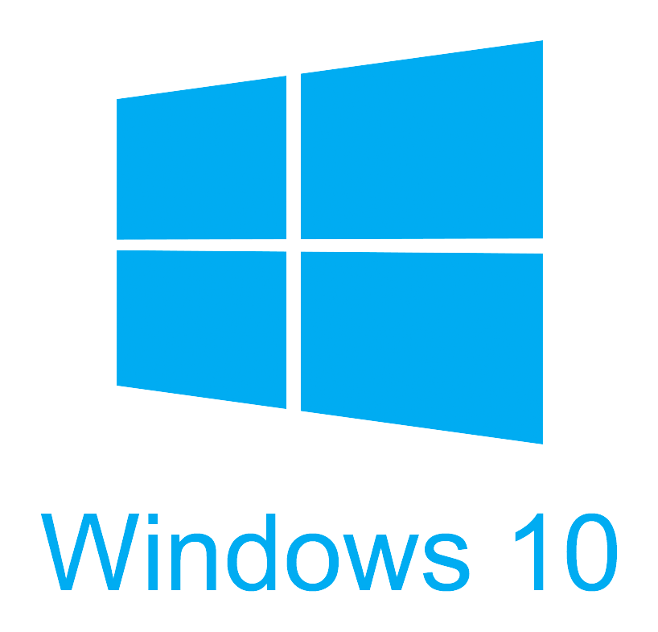

# IT Shark Mobile - Universal Windows Platform

Здесь можно найти список ссылок на полезные, необходимые материалы и ресурсы по разработке универсальных приложений для Windows.

## Курсы
- [Введение в разработку приложений на Windows 10](https://mva.microsoft.com/ru/training-courses/-windows-10-15867?l=te9X0gf7B_5605192797)
- [Разработка для Windows 10 для начинающих](https://mva.microsoft.com/ru/training-courses/-windows-10--14541?l=cWn0dxwqB_4305632527) :gb:

&nbsp;

Есть идеи по развитию или просто хотите исправить ошибку? Вы можете [написать нам](https://github.com/it-shark-pro/mobile-school/issues/new)!

---
 IT Shark Community
